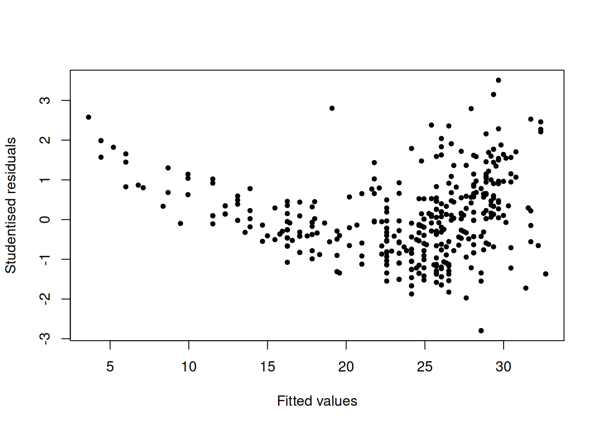
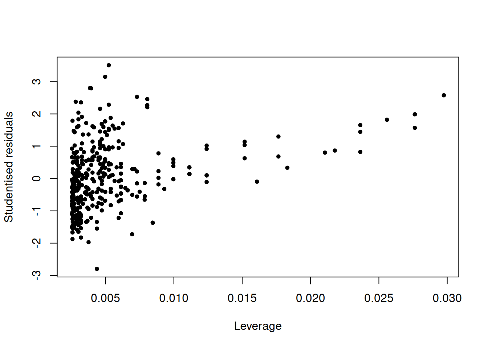
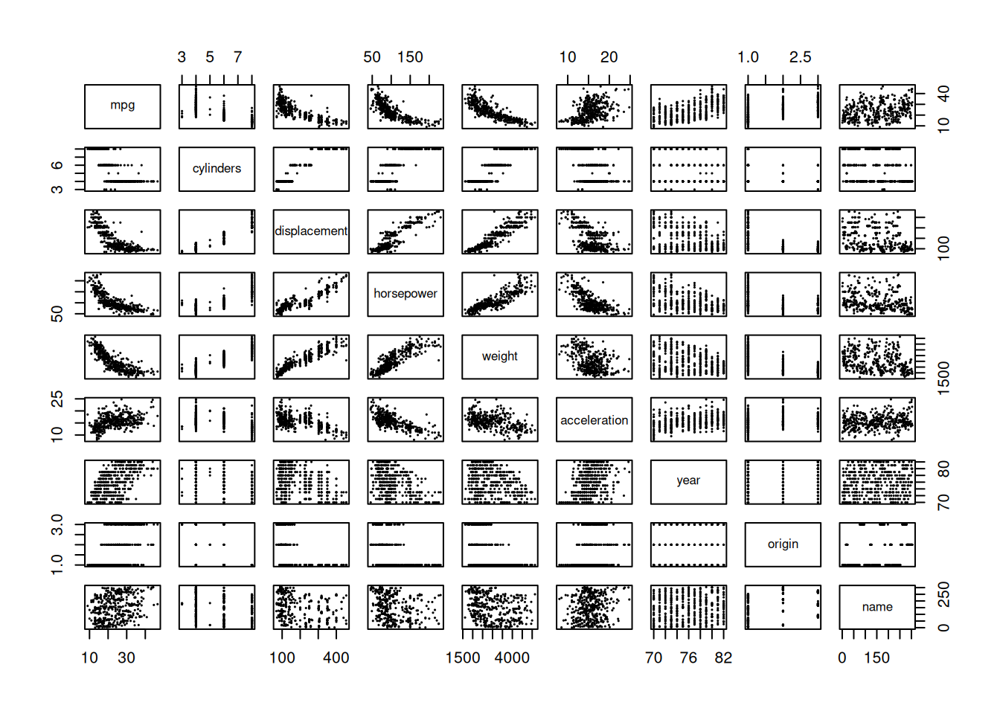
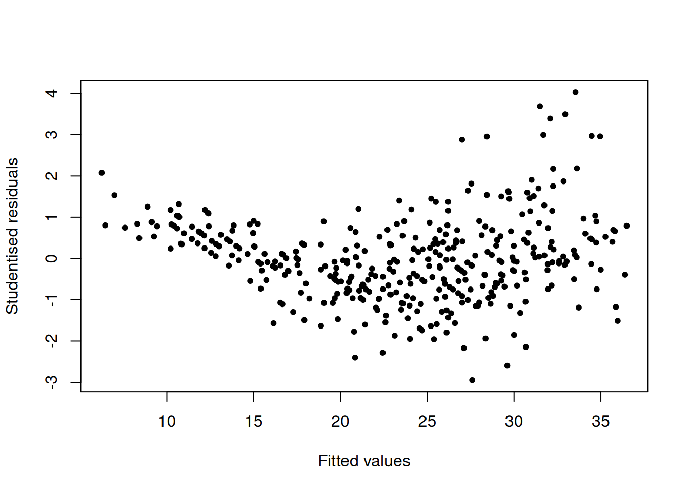
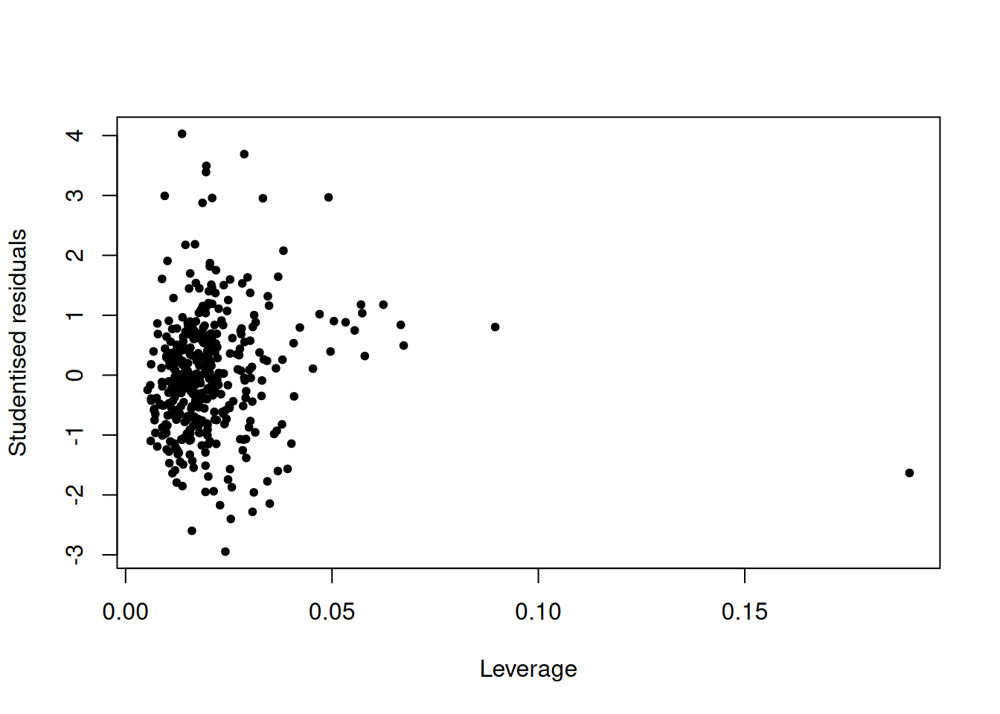

# Linear Regression

## Conceptual

### Question 1

> Describe the null hypotheses to which the _p_values given in Table 3.4
> correspond. Explain what conclusions you can draw based on these _p_values.
> Your explanation should be phrased in terms of `sales`, `TV`, `radio`, and
> `newspaper`, rather than in terms of the coefficients of the linear model.

### Question 2

> Carefully explain the differences between the KNN classifier and KNN
> regression methods.

### Question 3

> Suppose we have a data set with five predictors, $X_1$ = GPA, $X_2$ = IQ,
> $X_3$ = Level (1 for College and 0 for High School), $X_4$ = Interaction
> between GPA and IQ, and $X_5$ = Interaction between GPA and Level. The
> response is starting salary after graduation (in thousands of dollars).
> Suppose we use least squares to fit the model, and get $\hat\beta_0 = 50$,
> $\hat\beta_1 = 20$, $\hat\beta_2 = 0.07$, $\hat\beta_3 = 35$, $\hat\beta_4 =
> 0.01$, $\hat\beta_5 = -10$.
>
> a. Which answer is correct, and why?
>     i. For a fixed value of IQ and GPA, high school graduates earn more on
>        average than college graduates.
>     ii. For a fixed value of IQ and GPA, college graduates earn more on
>         average than high school graduates.
>     iii. For a fixed value of IQ and GPA, high school graduates earn more on
>          average than college graduates provided that the GPA is high enough.
>     iv. For a fixed value of IQ and GPA, college graduates earn more on 
>         average than high school graduates provided that the GPA is high 
>         enough.
>
> b. Predict the salary of a college graduate with IQ of 110 and a GPA of 4.0.
>
> c. True or false: Since the coefficient for the GPA/IQ interaction term is
>    very small, there is very little evidence of an interaction effect. Justify
>    your answer.

### Question 4

> I collect a set of data ($n = 100$ observations) containing a single predictor
> and a quantitative response. I then fit a linear regression model to the data,
> as well as a separate cubic regression, i.e. $Y = \beta_0 + \beta_1X +
> \beta_2X^2 + \beta_3X^3 + \epsilon$.
>
> a. Suppose that the true relationship between $X$ and $Y$ is linear,
>    i.e. $Y = \beta_0 + \beta_1X + \epsilon$. Consider the training residual
>    sum of squares (RSS) for the linear regression, and also the training RSS
>    for the cubic regression. Would we expect one to be lower than the other,
>    would we expect them to be the same, or is there not enough information to
>    tell? Justify your answer.
>
> b. Answer (a) using test rather than training RSS.
>
> c. Suppose that the true relationship between $X$ and $Y$ is not linear, but
>    we don't know how far it is from linear. Consider the training RSS for the
>    linear regression, and also the training RSS for the cubic regression.
>    Would we expect one to be lower than the other, would we expect them to be
>    the same, or is there not enough information to tell? Justify your answer.
>
> d. Answer (c) using test rather than training RSS.

### Question 5

> Consider the fitted values that result from performing linear regression
> without an intercept. In this setting, the ith fitted value takes the form
> $$\hat{y}_i = x_i\hat\beta,$$
> where
> $$\hat{\beta} = \left(\sum_{i=1}^nx_iy_i\right) / \left(\sum_{i' = 1}^n x^2_{i'}\right).$$
> show that we can write
> $$\hat{y}_i = \sum_{i' = 1}^na_{i'}y_{i'}$$
> What is $a_{i'}$?
>
> _Note: We interpret this result by saying that the fitted
> values from linear regression are linear combinations of the response values._

### Question 6

> Using (3.4), argue that in the case of simple linear regression, the
> least squares line always passes through the point $(\bar{x}, \bar{y})$.

### Question 7

> It is claimed in the text that in the case of simple linear regression
> of $Y$ onto $X$, the $R^2$ statistic (3.17) is equal to the square of the
> correlation between $X$ and $Y$ (3.18). Prove that this is the case. For
> simplicity, you may assume that $\bar{x} = \bar{y} = 0$.

## Applied

### Question 8

> This question involves the use of simple linear regression on the Auto
> data set.
>
> a. Use the `lm()` function to perform a simple linear regression with `mpg` as
>   the response and `horsepower` as the predictor. Use the `summary()` function
>   to print the results. Comment on the output. For example:


``` r
Auto <- read.table("data/Auto.data", na.strings = "?", stringsAsFactors = T, header = T)
Auto <- na.omit(Auto)
attach(Auto)
lm.fit <- lm(mpg ~ horsepower)
summary(lm.fit)
```

```
## 
## Call:
## lm(formula = mpg ~ horsepower)
## 
## Residuals:
##      Min       1Q   Median       3Q      Max 
## -13.5710  -3.2592  -0.3435   2.7630  16.9240 
## 
## Coefficients:
##              Estimate Std. Error t value Pr(>|t|)    
## (Intercept) 39.935861   0.717499   55.66   <2e-16 ***
## horsepower  -0.157845   0.006446  -24.49   <2e-16 ***
## ---
## Signif. codes:  0 '***' 0.001 '**' 0.01 '*' 0.05 '.' 0.1 ' ' 1
## 
## Residual standard error: 4.906 on 390 degrees of freedom
## Multiple R-squared:  0.6059,	Adjusted R-squared:  0.6049 
## F-statistic: 599.7 on 1 and 390 DF,  p-value: < 2.2e-16
```

>   i. Is there a relationship between the predictor and the response?

Yes. The p-value for the t-statistic for horsepower is extremely low, which suggests a relationship.

>   ii. How strong is the relationship between the predictor and the response?


``` r
mean(mpg)
```

```
## [1] 23.44592
```
The RSE is 4.906 while the mean value of the response is 23.44592.


``` r
sigma(lm.fit)/mean(mpg)
```

```
## [1] 0.2092371
```
This suggests a roughly 21% percentage error.

The $R^2$ statistic is 0.6059 so our predictor explains 60.59% of the variance in the response.

>   iii. Is the relationship between the predictor and the response positive or
>        negative?


``` r
coef(lm.fit)[["horsepower"]]
```

```
## [1] -0.1578447
```
The coefficient is less than 0, so the relationship is negative.
>   iv. What is the predicted mpg associated with a horsepower of 98?


``` r
predict(lm.fit, data.frame(horsepower = 98))[[1]]
```

```
## [1] 24.46708
```

>   v. What are the associated 95% confidence and prediction intervals?
>


``` r
predict(lm.fit, data.frame(horsepower = 98), interval = "confidence")
```

```
##        fit      lwr      upr
## 1 24.46708 23.97308 24.96108
```

``` r
predict(lm.fit, data.frame(horsepower = 98), interval = "prediction")
```

```
##        fit     lwr      upr
## 1 24.46708 14.8094 34.12476
```

> b. Plot the response and the predictor. Use the `abline()` function to display
>   the least squares regression line.
>


``` r
plot(horsepower, mpg, pch = 20)
abline(lm.fit, lwd = 3, col = "red")
```


> c. Use the `plot()` function to produce diagnostic plots of the least squares
>   regression fit. Comment on any problems you see with the fit.


``` r
plot(predict(lm.fit), residuals(lm.fit), pch = 20, xlab = "Fitted values", ylab = "Residuals")
```


There appears to be some evidence of non-linearity as it looks like there is a relationship between the fitted values and residuals.


``` r
plot(predict(lm.fit), rstudent(lm.fit), pch = 20, xlab = "Fitted values", ylab = "Studentised residuals")
```



There are some data points with studentised residuals above 3 - these are possible outliers.


``` r
plot(hatvalues(lm.fit), rstudent(lm.fit), pch=20, xlab = "Leverage", ylab = "Studentised residuals")
```


There are a few very high leverage points, however none are outside the studentised residual range of 3 to -3.

### Question 9

> This question involves the use of multiple linear regression on the `Auto`
> data set.
>
> a. Produce a scatterplot matrix which includes all of the variables in the
>    data set.
>


``` r
pairs(Auto, pch=20, cex=0.2)
```



> b. Compute the matrix of correlations between the variables using the function
>    `cor()`. You will need to exclude the name variable, `name` which is
>    qualitative.
>


``` r
cor(Auto[,!(names(Auto) %in% "name")])
```

```
##                     mpg  cylinders displacement horsepower     weight
## mpg           1.0000000 -0.7776175   -0.8051269 -0.7784268 -0.8322442
## cylinders    -0.7776175  1.0000000    0.9508233  0.8429834  0.8975273
## displacement -0.8051269  0.9508233    1.0000000  0.8972570  0.9329944
## horsepower   -0.7784268  0.8429834    0.8972570  1.0000000  0.8645377
## weight       -0.8322442  0.8975273    0.9329944  0.8645377  1.0000000
## acceleration  0.4233285 -0.5046834   -0.5438005 -0.6891955 -0.4168392
## year          0.5805410 -0.3456474   -0.3698552 -0.4163615 -0.3091199
## origin        0.5652088 -0.5689316   -0.6145351 -0.4551715 -0.5850054
##              acceleration       year     origin
## mpg             0.4233285  0.5805410  0.5652088
## cylinders      -0.5046834 -0.3456474 -0.5689316
## displacement   -0.5438005 -0.3698552 -0.6145351
## horsepower     -0.6891955 -0.4163615 -0.4551715
## weight         -0.4168392 -0.3091199 -0.5850054
## acceleration    1.0000000  0.2903161  0.2127458
## year            0.2903161  1.0000000  0.1815277
## origin          0.2127458  0.1815277  1.0000000
```

> c. Use the `lm()` function to perform a multiple linear regression with `mpg`
>    as the response and all other variables except name as the predictors. Use 
>    the `summary()` function to print the results. Comment on the output. For
>    instance:


``` r
lm.fit <- lm(mpg ~ . - name, data = Auto)
summary(lm.fit)
```

```
## 
## Call:
## lm(formula = mpg ~ . - name, data = Auto)
## 
## Residuals:
##     Min      1Q  Median      3Q     Max 
## -9.5903 -2.1565 -0.1169  1.8690 13.0604 
## 
## Coefficients:
##                Estimate Std. Error t value Pr(>|t|)    
## (Intercept)  -17.218435   4.644294  -3.707  0.00024 ***
## cylinders     -0.493376   0.323282  -1.526  0.12780    
## displacement   0.019896   0.007515   2.647  0.00844 ** 
## horsepower    -0.016951   0.013787  -1.230  0.21963    
## weight        -0.006474   0.000652  -9.929  < 2e-16 ***
## acceleration   0.080576   0.098845   0.815  0.41548    
## year           0.750773   0.050973  14.729  < 2e-16 ***
## origin         1.426141   0.278136   5.127 4.67e-07 ***
## ---
## Signif. codes:  0 '***' 0.001 '**' 0.01 '*' 0.05 '.' 0.1 ' ' 1
## 
## Residual standard error: 3.328 on 384 degrees of freedom
## Multiple R-squared:  0.8215,	Adjusted R-squared:  0.8182 
## F-statistic: 252.4 on 7 and 384 DF,  p-value: < 2.2e-16
```

>    i. Is there a relationship between the predictors and the response?

Yes, as the p-value calculated from the F-test is very low.

>    ii. Which predictors appear to have a statistically significant relationship
>       to the response?

`displacement`, `weight`, `year`, and `origin`.

>    iii. What does the coefficient for the `year` variable suggest?
>

`year` and `mpg` have a positive relationship, so the later a car is produced, the higher its miles per gallon.

> d. Use the `plot()` function to produce diagnostic plots of the linear
>    regression fit. Comment on any problems you see with the fit. Do the
>    residual plots suggest any unusually large outliers? Does the leverage plot
>    identify any observations with unusually high leverage?
>


``` r
plot(predict(lm.fit), residuals(lm.fit), pch = 20, xlab = "Fitted values", ylab = "Residuals")
```


There seems to be some kind of non-linearity in our dataset as the residuals seem to have some relationship with the fitted values.


``` r
plot(predict(lm.fit), rstudent(lm.fit), pch = 20, xlab = "Fitted values", ylab = "Studentised residuals")
```


There are quite a few high residual values; their studentised residual values are above 3 which indicates an outlier.


``` r
plot(hatvalues(lm.fit), rstudent(lm.fit), pch=20, xlab = "Leverage", ylab = "Studentised residuals")
```



``` r
max(hatvalues(lm.fit))
```

```
## [1] 0.1899129
```
There is a very high leverage point with a leverage of 0.19.

> e. Use the `*` and `:` symbols to fit linear regression models with
>    interaction effects. Do any interactions appear to be statistically
>    significant?
>


``` r
lm.fit <- lm(mpg ~ (. - name) * (. - name), data = Auto)
summary(lm.fit)
```

```
## 
## Call:
## lm(formula = mpg ~ (. - name) * (. - name), data = Auto)
## 
## Residuals:
##     Min      1Q  Median      3Q     Max 
## -7.6303 -1.4481  0.0596  1.2739 11.1386 
## 
## Coefficients:
##                             Estimate Std. Error t value Pr(>|t|)   
## (Intercept)                3.548e+01  5.314e+01   0.668  0.50475   
## cylinders                  6.989e+00  8.248e+00   0.847  0.39738   
## displacement              -4.785e-01  1.894e-01  -2.527  0.01192 * 
## horsepower                 5.034e-01  3.470e-01   1.451  0.14769   
## weight                     4.133e-03  1.759e-02   0.235  0.81442   
## acceleration              -5.859e+00  2.174e+00  -2.696  0.00735 **
## year                       6.974e-01  6.097e-01   1.144  0.25340   
## origin                    -2.090e+01  7.097e+00  -2.944  0.00345 **
## cylinders:displacement    -3.383e-03  6.455e-03  -0.524  0.60051   
## cylinders:horsepower       1.161e-02  2.420e-02   0.480  0.63157   
## cylinders:weight           3.575e-04  8.955e-04   0.399  0.69000   
## cylinders:acceleration     2.779e-01  1.664e-01   1.670  0.09584 . 
## cylinders:year            -1.741e-01  9.714e-02  -1.793  0.07389 . 
## cylinders:origin           4.022e-01  4.926e-01   0.816  0.41482   
## displacement:horsepower   -8.491e-05  2.885e-04  -0.294  0.76867   
## displacement:weight        2.472e-05  1.470e-05   1.682  0.09342 . 
## displacement:acceleration -3.479e-03  3.342e-03  -1.041  0.29853   
## displacement:year          5.934e-03  2.391e-03   2.482  0.01352 * 
## displacement:origin        2.398e-02  1.947e-02   1.232  0.21875   
## horsepower:weight         -1.968e-05  2.924e-05  -0.673  0.50124   
## horsepower:acceleration   -7.213e-03  3.719e-03  -1.939  0.05325 . 
## horsepower:year           -5.838e-03  3.938e-03  -1.482  0.13916   
## horsepower:origin          2.233e-03  2.930e-02   0.076  0.93931   
## weight:acceleration        2.346e-04  2.289e-04   1.025  0.30596   
## weight:year               -2.245e-04  2.127e-04  -1.056  0.29182   
## weight:origin             -5.789e-04  1.591e-03  -0.364  0.71623   
## acceleration:year          5.562e-02  2.558e-02   2.174  0.03033 * 
## acceleration:origin        4.583e-01  1.567e-01   2.926  0.00365 **
## year:origin                1.393e-01  7.399e-02   1.882  0.06062 . 
## ---
## Signif. codes:  0 '***' 0.001 '**' 0.01 '*' 0.05 '.' 0.1 ' ' 1
## 
## Residual standard error: 2.695 on 363 degrees of freedom
## Multiple R-squared:  0.8893,	Adjusted R-squared:  0.8808 
## F-statistic: 104.2 on 28 and 363 DF,  p-value: < 2.2e-16
```

Adding all possible interaction terms, `acceleration:origin` seems to be the one with the highest statistical significance. `acceleration:year` and `displacement:year` are also below the 0.05 level of significance, so should likely be included as well.


``` r
lm.fitnoint <- lm(mpg ~ . - name, data = Auto)
lm.fitint <- lm(mpg ~ . - name + acceleration:origin + acceleration:year + displacement:year, data = Auto)

anova(lm.fitnoint, lm.fitint)
```

```
## Analysis of Variance Table
## 
## Model 1: mpg ~ (cylinders + displacement + horsepower + weight + acceleration + 
##     year + origin + name) - name
## Model 2: mpg ~ (cylinders + displacement + horsepower + weight + acceleration + 
##     year + origin + name) - name + acceleration:origin + acceleration:year + 
##     displacement:year
##   Res.Df    RSS Df Sum of Sq      F    Pr(>F)    
## 1    384 4252.2                                  
## 2    381 3457.6  3    794.63 29.188 < 2.2e-16 ***
## ---
## Signif. codes:  0 '***' 0.001 '**' 0.01 '*' 0.05 '.' 0.1 ' ' 1
```
The ANOVA test shows that including these interaction terms significantly increases the fit of the model.

> f. Try a few different transformations of the variables, such as $log(X)$,
>    $\sqrt{X}$, $X^2$. Comment on your findings.

Let's look at `horsepower`:


``` r
par(mfrow = c(2, 2))
plot(horsepower, mpg, pch = 20)
plot(log(horsepower), mpg, pch = 20)
plot(sqrt(horsepower), mpg, pch = 20)
plot(horsepower^2, mpg, pch = 20)
```


Looking at these plots, the relationship between `log(horsepower)` and `mpg` seems more linear.


``` r
lm.fitlog <- lm(mpg ~ . - name + log(horsepower), data = Auto)
lm.fitnolog <- lm(mpg ~ . - name, data = Auto)

anova(lm.fitnolog, lm.fitlog)
```

```
## Analysis of Variance Table
## 
## Model 1: mpg ~ (cylinders + displacement + horsepower + weight + acceleration + 
##     year + origin + name) - name
## Model 2: mpg ~ (cylinders + displacement + horsepower + weight + acceleration + 
##     year + origin + name) - name + log(horsepower)
##   Res.Df    RSS Df Sum of Sq      F    Pr(>F)    
## 1    384 4252.2                                  
## 2    383 3354.0  1    898.19 102.56 < 2.2e-16 ***
## ---
## Signif. codes:  0 '***' 0.001 '**' 0.01 '*' 0.05 '.' 0.1 ' ' 1
```
The ANOVA test shows that including the `log(horsepower)` term significantly improves the performance of the model. 

### Question 10

> This question should be answered using the `Carseats` data set.
>
> a. Fit a multiple regression model to predict `Sales` using `Price`, `Urban`,
>    and `US`.
>
> b. Provide an interpretation of each coefficient in the model. Be
>    careful---some of the variables in the model are qualitative!
>
> c. Write out the model in equation form, being careful to handle the
>    qualitative variables properly.
>
> d. For which of the predictors can you reject the null hypothesis
>    $H_0 : \beta_j = 0$?
>
> e. On the basis of your response to the previous question, fit a smaller model
>    that only uses the predictors for which there is evidence of association
>    with the outcome.
>
> f. How well do the models in (a) and (e) fit the data?
>
> g. Using the model from (e), obtain 95% confidence intervals for the
>    coefficient(s).
>
> h. Is there evidence of outliers or high leverage observations in the model
>    from (e)?

### Question 11

> In this problem we will investigate the _t_-statistic for the null hypothesis
> $H_0 : \beta = 0$ in simple linear regression without an intercept. To
> begin, we generate a predictor `x` and a response `y` as follows.
> ```r
> set.seed(1)
> x <- rnorm(100)
> y <- 2 * x + rnorm(100)
> ```
>
> a. Perform a simple linear regression of `y` onto `x`, _without_ an intercept.
>    Report the coefficient estimate $\hat{\beta}$, the standard error of this
>    coefficient estimate, and the _t_-statistic and _p_value associated with the
>    null hypothesis $H_0 : \beta = 0$. Comment on these results. (You can
>    perform regression without an intercept using the command `lm(y~x+0)`.)
>
> b. Now perform a simple linear regression of `x` onto `y` without an intercept,
>    and report the coefficient estimate, its standard error, and the
>    corresponding _t_-statistic and _p_values associated with the null hypothesis
>    $H_0 : \beta = 0$. Comment on these results.
>
> c. What is the relationship between the results obtained in (a) and (b)?
>
> d. For the regression of $Y$ onto $X$ without an intercept, the
>    _t_-statistic for $H_0 : \beta = 0$ takes the form 
>    $\hat{\beta}/SE(\hat{\beta})$, where $\hat{\beta}$ is given by (3.38), and
>    where
>    $$
>    SE(\hat\beta) = \sqrt{\frac{\sum_{i=1}^n(y_i - x_i\hat\beta)^2}{(n-1)\sum_{i'=1}^nx_{i'}^2}}.
>    $$
>    (These formulas are slightly different from those given in Sections 3.1.1 and
>    3.1.2, since here we are performing regression without an intercept.) Show
>    algebraically, and confirm numerically in R, that the _t_-statistic can be
>    written as
>    $$
>    \frac{(\sqrt{n-1}) \sum_{i-1}^nx_iy_i)}
>         {\sqrt{(\sum_{i=1}^nx_i^2)(\sum_{i'=1}^ny_{i'}^2)-(\sum_{i'=1}^nx_{i'}y_{i'})^2}}
>    $$
>
> e. Using the results from (d), argue that the _t_-statistic for the
>    regression of y onto x is the same as the _t_-statistic for the regression
>    of `x` onto `y`.
>
> f. In `R`, show that when regression is performed _with_ an intercept, the
>    _t_-statistic for $H_0 : \beta_1 = 0$ is the same for the regression of `y`
>    onto `x` as it is for the regression of `x` onto `y`.

### Question 12

> This problem involves simple linear regression without an intercept.
>
> a. Recall that the coefficient estimate $\hat{\beta}$ for the linear
>    regression of $Y$ onto $X$ without an intercept is given by (3.38). Under
>    what circumstance is the coefficient estimate for the regression of $X$
>    onto $Y$ the same as the coefficient estimate for the regression of $Y$
>    onto $X$?
>
> b. Generate an example in `R` with $n = 100$ observations in which the
>    coefficient estimate for the regression of $X$ onto $Y$ is different from
>    the coefficient estimate for the regression of $Y$ onto $X$.
>
> c. Generate an example in `R` with $n = 100$ observations in which the
>    coefficient estimate for the regression of $X$ onto $Y$ is the same as the
>    coefficient estimate for the regression of $Y$ onto $X$.

### Question 13

> In this exercise you will create some simulated data and will fit simple
> linear regression models to it. Make sure to use `set.seed(1)` prior to
> starting part (a) to ensure consistent results.
>
> a. Using the `rnorm()` function, create a vector, `x`, containing 100
>    observations drawn from a $N(0, 1)$ distribution. This represents a
>    feature, $X$.
>
> b. Using the `rnorm()` function, create a vector, `eps`, containing 100
>    observations drawn from a $N(0, 0.25)$ distribution---a normal
>    distribution with mean zero and variance 0.25.
>
> c. Using x and `eps`, generate a vector y according to the model
>    $$Y = -1 + 0.5X + \epsilon$$
>    What is the length of the vector `y`? What are the values of
>    $\beta_0$ and $\beta_1$ in this linear model?
>
> d. Create a scatterplot displaying the relationship between `x` and `y`.
>    Comment on what you observe.
>
> e. Fit a least squares linear model to predict `y` using `x`. Comment on the
>    model obtained. How do $\hat\beta_0$ and $\hat\beta_1$ compare to $\beta_0$
>    and $\beta_1$?
>
> f. Display the least squares line on the scatterplot obtained in (d). Draw the
>    population regression line on the plot, in a different color. Use the
>    `legend()` command to create an appropriate legend.
>
> g. Now fit a polynomial regression model that predicts `y` using `x` and `x^2`.
>    Is there evidence that the quadratic term improves the model fit? Explain
>    your answer.
>
> h. Repeat (a)--(f) after modifying the data generation process in such a way
>    that there is *less* noise in the data. The model (3.39) should remain the
>    same. You can do this by decreasing the variance of the normal distribution
>    used to generate the error term $\epsilon$ in (b). Describe your results.
>
> i. Repeat (a)--(f) after modifying the data generation process in such a way
>    that there is *more* noise in the data. The model (3.39) should remain the
>    same. You can do this by increasing the variance of the normal distribution
>    used to generate the error term $\epsilon$ in (b). Describe your results.
>
> j. What are the confidence intervals for $\beta_0$ and $\beta_1$ based on the
>    original data set, the noisier data set, and the less noisy data set?
>    Comment on your results.

### Question 14

> This problem focuses on the collinearity problem.
>
> a. Perform the following commands in R :
>    
>    ```r
>    > set.seed(1)
>    > x1 <- runif(100)
>    > x2 <- 0.5 * x1 + rnorm(100) / 10
>    > y <- 2 + 2 * x1 + 0.3 * x2 + rnorm(100)
>    ```
>
>    The last line corresponds to creating a linear model in which `y` is a
>    function of `x1` and `x2`. Write out the form of the linear model. What are
>    the regression coefficients?
>
> b. What is the correlation between `x1` and `x2`? Create a scatterplot
>    displaying the relationship between the variables.
>
> c. Using this data, fit a least squares regression to predict `y` using `x1`
>    and `x2`. Describe the results obtained. What are $\hat\beta_0$,
>    $\hat\beta_1$, and $\hat\beta_2$? How do these relate to the true $\beta_0$,
>    $\beta_1$, and \beta_2$? Can you reject the null hypothesis $H_0 : \beta_1$
>    = 0$? How about the null hypothesis $H_0 : \beta_2 = 0$?
>
> d. Now fit a least squares regression to predict `y` using only `x1`. Comment
>    on your results. Can you reject the null hypothesis $H 0 : \beta_1 = 0$?
>
> e. Now fit a least squares regression to predict `y` using only `x2`. Comment
>    on your results. Can you reject the null hypothesis $H_0 : \beta_1 = 0$?
>
> f. Do the results obtained in (c)--(e) contradict each other? Explain your
>    answer.
>
> g. Now suppose we obtain one additional observation, which was unfortunately
>    mismeasured.
>    ```r
>    > x1 <- c(x1, 0.1)
>    > x2 <- c(x2, 0.8)
>    > y <- c(y, 6)
>    ```
>    Re-fit the linear models from (c) to (e) using this new data. What effect
>    does this new observation have on the each of the models? In each model, is
>    this observation an outlier? A high-leverage point? Both? Explain your
>    answers.

### Question 15

> This problem involves the `Boston` data set, which we saw in the lab for this
> chapter. We will now try to predict per capita crime rate using the other
> variables in this data set. In other words, per capita crime rate is the
> response, and the other variables are the predictors.
>
> a. For each predictor, fit a simple linear regression model to predict the
>    response. Describe your results. In which of the models is there a
>    statistically significant association between the predictor and the
>    response? Create some plots to back up your assertions.
>
> b. Fit a multiple regression model to predict the response using all of the
>    predictors. Describe your results. For which predictors can we reject the
>    null hypothesis $H_0 : \beta_j = 0$?
>
> c. How do your results from (a) compare to your results from (b)? Create a
>    plot displaying the univariate regression coefficients from (a) on the
>    $x$-axis, and the multiple regression coefficients from (b) on the
>    $y$-axis. That is, each predictor is displayed as a single point in the
>    plot. Its coefficient in a simple linear regression model is shown on the
>    x-axis, and its coefficient estimate in the multiple linear regression
>    model is shown on the y-axis.
>
> d. Is there evidence of non-linear association between any of the predictors
>    and the response? To answer this question, for each predictor X, fit a
>    model of the form 
>    $$
>    Y = \beta_0 + \beta_1X + \beta_2X^2 + \beta_3X^3 + \epsilon
>    $$
