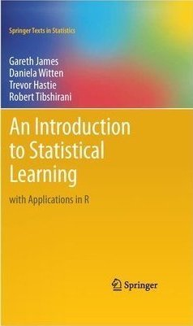

# ISLRv2 Solutions

This repository provides my solutions to the end of chapter exercises in the book [An
Introduction to Statistical Learning] by Gareth James, Daniela Witten, Trevor
Hastie and Robert Tibshirani.

Thank you to [Dan Halligan](https://github.com/danhalligan) for providing the template for this repository, and the original authors for their work on ISL.

[An Introduction to Statistical Learning]: https://www.statlearning.com/
